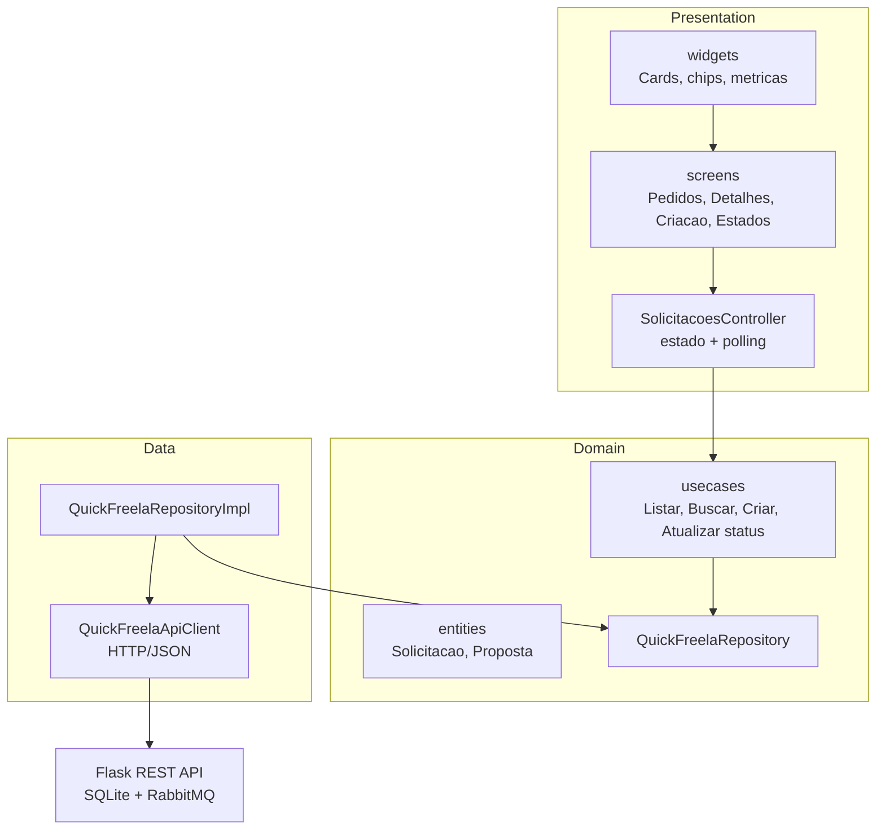

# Arquitetura Flutter - Sprint 3

O app do cliente foi organizado em camadas inspiradas em Clean Architecture. A interface nao conhece detalhes de HTTP, e a camada de dados nao depende dos widgets.

## Camadas

| Camada | Pasta | Responsabilidade |
| --- | --- | --- |
| Core | `lib/core` | Configuracao da URL da API, tema visual, formatadores e erros compartilhados |
| Domain | `lib/domain` | Entidades do negocio, contrato de repositorio e casos de uso |
| Data | `lib/data` | Conversao JSON, cliente HTTP e implementacao do repositorio REST |
| Presentation | `lib/presentation` | Telas, widgets reutilizaveis e controller de estado |

## Atualizacao assincrona

O mecanismo equivalente ao recebimento assincrono foi implementado com polling controlado no `SolicitacoesController`. Ao iniciar o app, o controller chama `GET /solicitacoes?cliente_id=1` e agenda novas consultas a cada 6 segundos. Quando o backend muda o status de uma solicitacao, a lista em memoria e substituida, `notifyListeners()` e chamado e as telas sao redesenhadas automaticamente.

## Fluxo principal

1. Cliente abre o app e ve suas solicitacoes.
2. App busca dados no backend REST.
3. Cliente cria uma nova solicitacao pelo formulario.
4. Backend responde com a solicitacao criada.
5. App passa a monitorar alteracoes de status por polling.
6. Se outro processo altera o status no backend, o app reflete a mudanca sem acao manual.

## Endpoints consumidos

| Metodo | Endpoint | Uso no app |
| --- | --- | --- |
| GET | `/solicitacoes?cliente_id=1` | Listagem e atualizacao automatica |
| GET | `/solicitacoes/<id>` | Tela de detalhes |
| POST | `/solicitacoes` | Criacao de nova demanda |
| PATCH | `/solicitacoes/<id>/status` | Acao de cancelar/concluir |
| GET | `/propostas?solicitacao_id=<id>` | Propostas da tela de detalhes |
