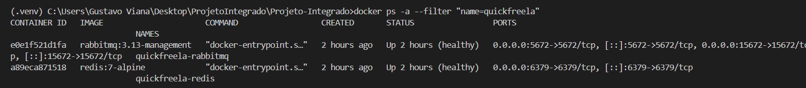
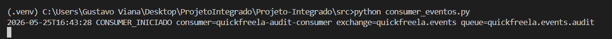
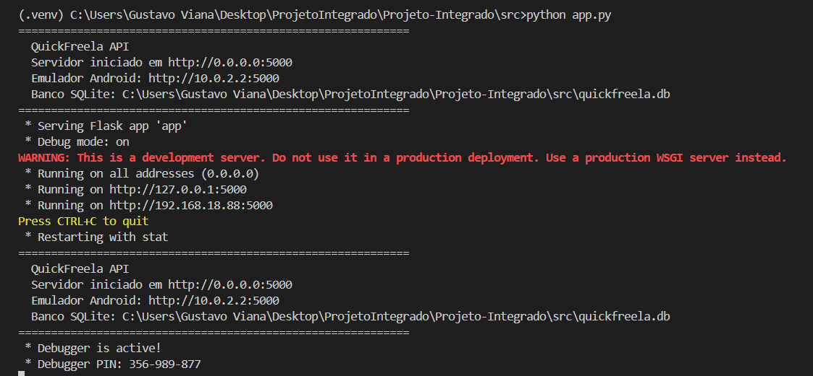
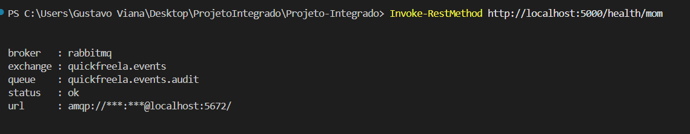
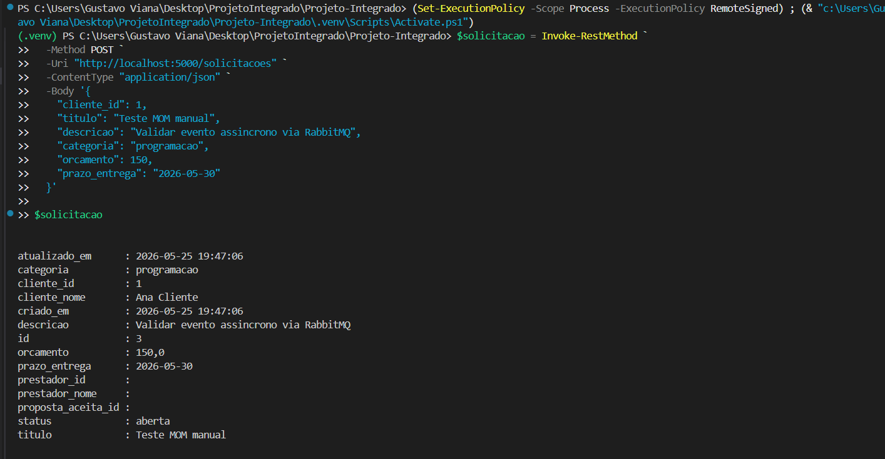
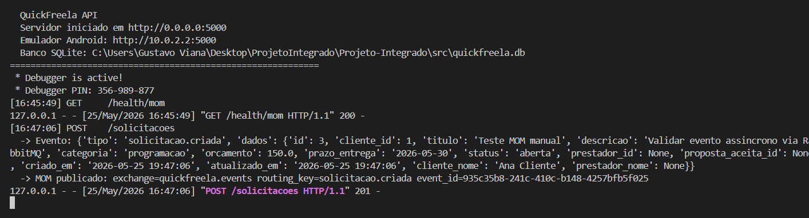
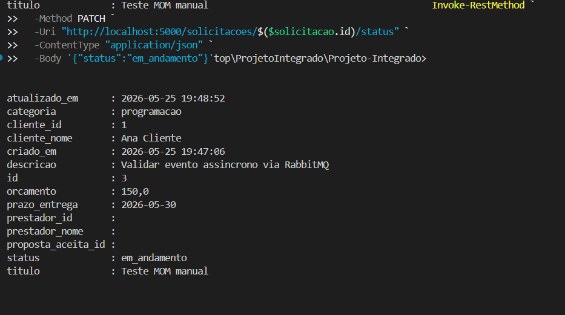
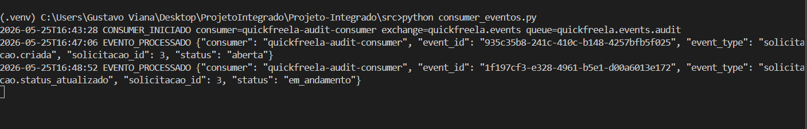

# Evidencia de Funcionamento do MOM

# Docker rodando

# Consumer sendo iniciado

# Servidor sendo iniciado

# MOM rodando

# Chamando evento

# Resposta do servidor

# Evento de alterar status

# Consumer processando eventos
